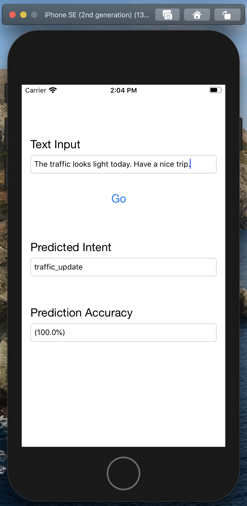
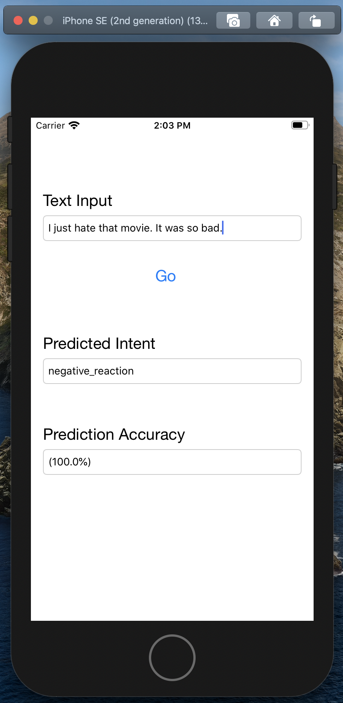
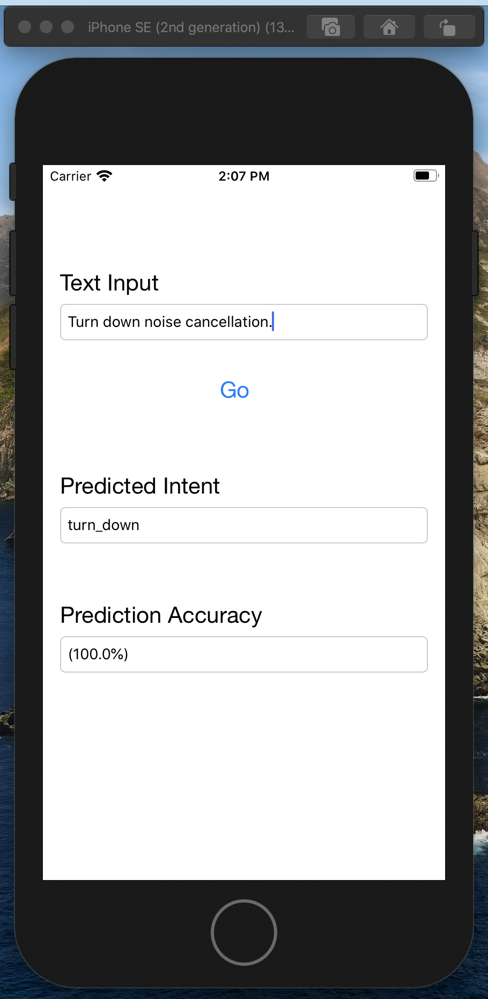

# Utterance-Intent-Classification

***This repository contains the code for training a Machine Learning model for Intent Classification based on Utterance and it's deployment in an iOS applications using CoreML.***

# Examples

            
